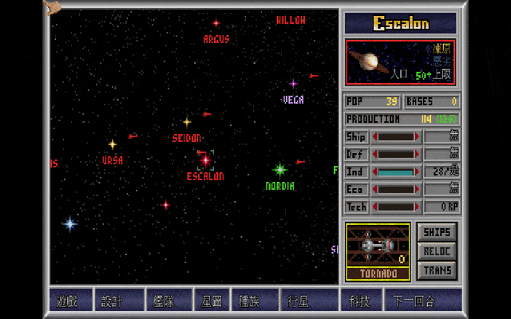
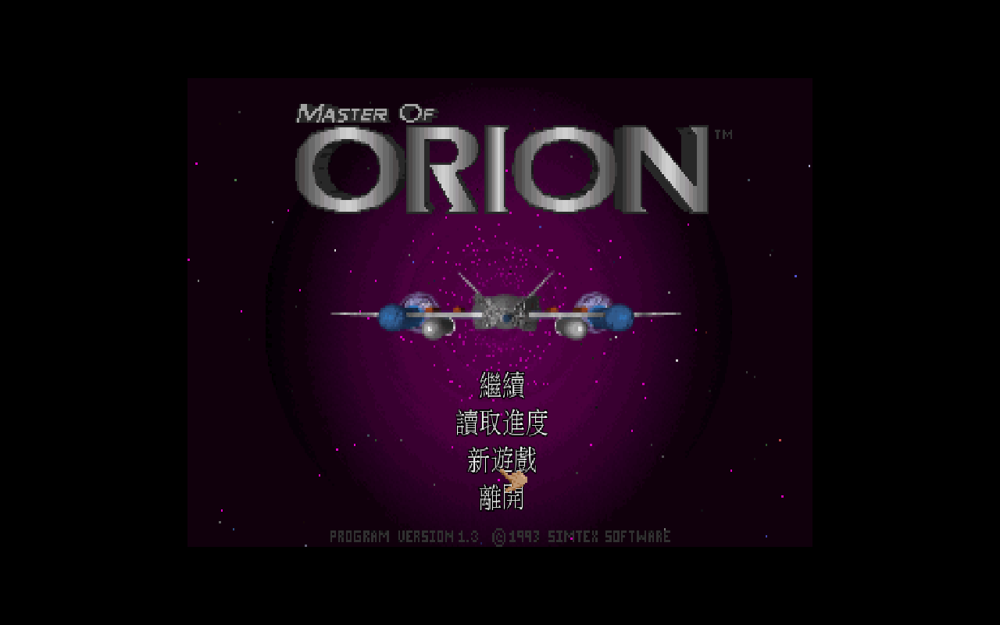
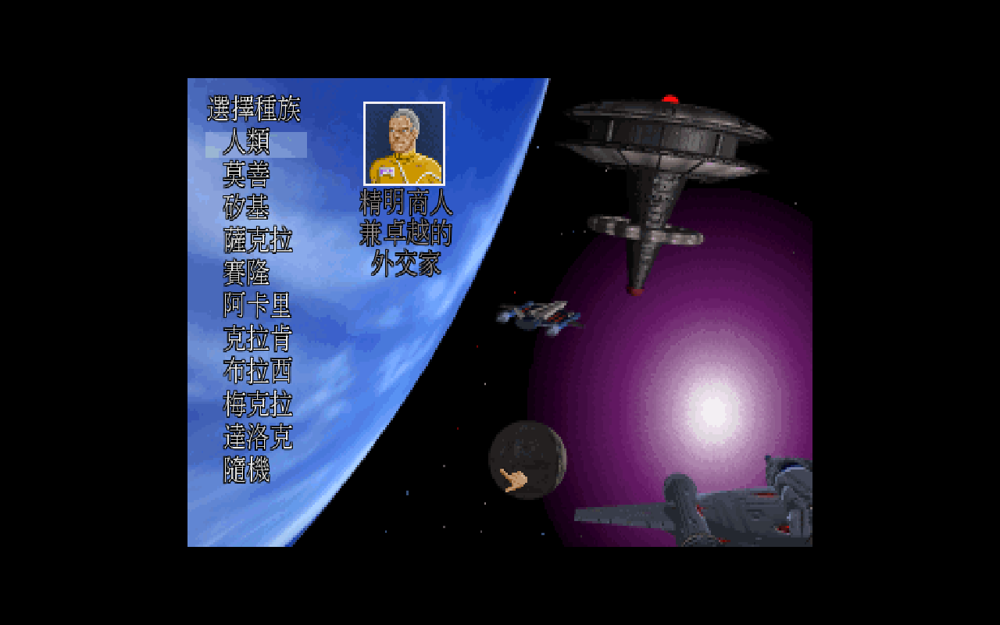
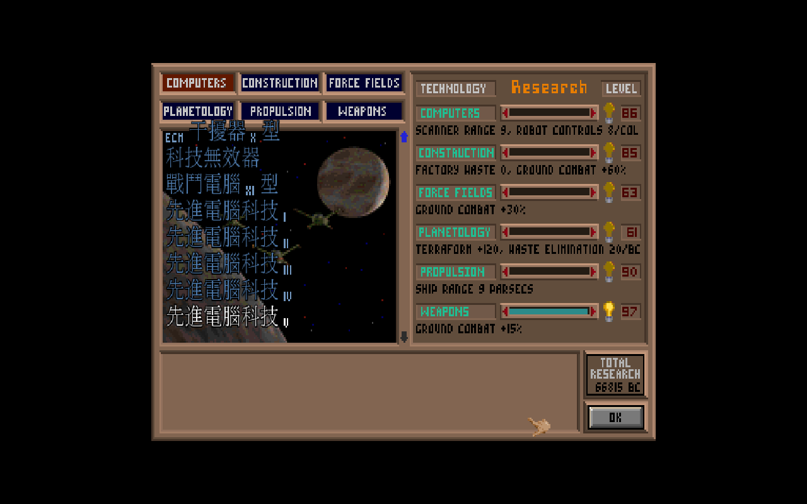
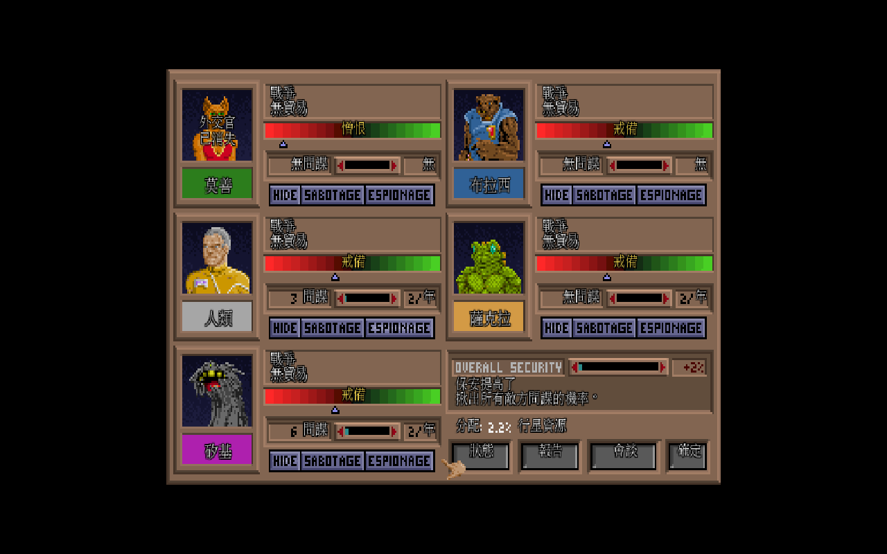
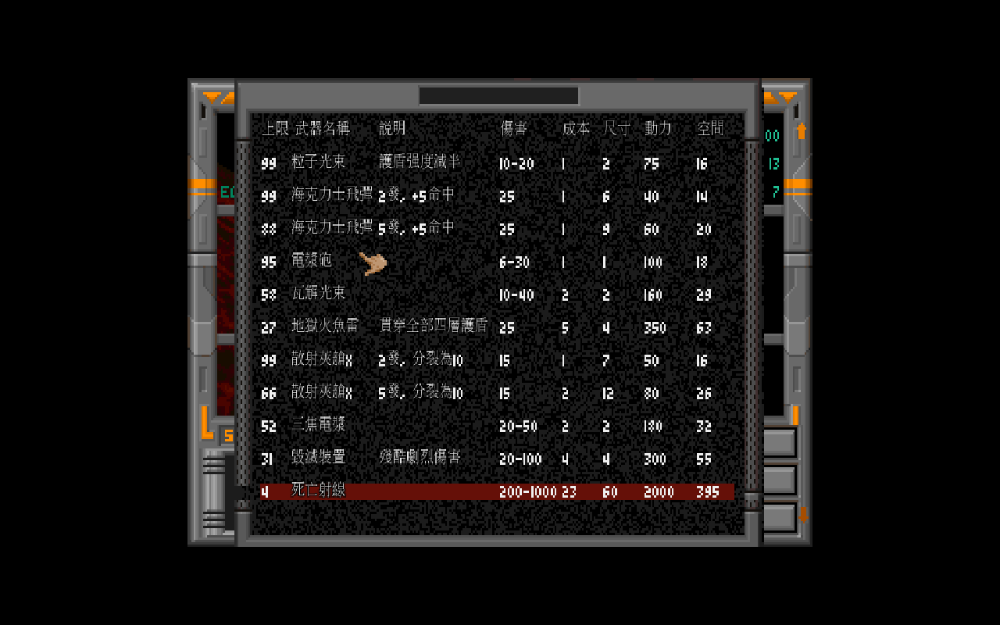

# 銀河霸主 繁體中文化 — Master of Orion 1 (1oom)

> 1993 年的 4X 始祖《銀河霸主》(Master of Orion, MicroProse),現在能用**繁體中文**從頭玩到尾——研究、外交、艦船設計、星圖,全程母語。跑在開源重製引擎 [1oom](https://git.sourcecraft.dev/fork1oom/1oom) 上。

這款奠定「探索 / 擴張 / 開發 / 殲滅」四大支柱的太空策略經典,當年沒有官方中文版,三十年來也沒人完整漢化。難點不在「翻字」,在**畫面**:MOO1 是固定 320×200 點陣,中文筆畫多,直接塞進去不是糊成一團就是擠爆版面。我們沒有妥協縮小硬塞,而是**自製一條 24×24 高解析 CJK 渲染管線**——把畫面放進 2× 合成層畫中文,底圖維持 pixel art 銳利,中文清晰可讀。

而且文字不只藏在程式碼裡,還烘在版權資料檔(`.lbx`)、甚至背景圖的影像中。這份專案把三個地方的文字一次解掉,且**全程不修改、不散布任何版權檔案**——只散布 patch、字型與譯文,玩家自備正版 MOO 套上即可。



> 從研究畫面 → 種族關係 → 外交會談 → 艦船設計 → 星圖,全程繁體中文。

---

## 成果一覽

| | |
|---|---|
|  |  |
| **主選單**:繼續 / 讀取進度 / 新遊戲 / 離開 | **新遊戲設定**:標籤、數值、按鈕全中文且對齊 |
|  |  |
| **種族選擇**:十大種族 + 種族特性 | **研究畫面**:187 個科技名 + 描述全中文 |
|  |  |
| **種族關係**:外交態度、條約一目了然 | **艦船設計**:武器 / 裝備清單密集面板自動縮字不破版 |

星圖底部的常駐選單列也全中文:**遊戲 / 設計 / 艦隊 / 星圖 / 種族 / 行星 / 科技 / 下一回合**(見 `docs/img/milestone-starmap.png`)。

---

## 我們解決了什麼

老遊戲中文化最難的三道底層關卡,以及這份專案的解法。

### 1. 自製 24×24 高解析 CJK 渲染管線

MOO1 在 320×200 點陣算圖。一個格子放英文字綽綽有餘,但中文筆畫密,畫 24px 會爆版,縮到塞得下又糊到認不得。

解法是**換維度**(細節見 [`docs/adr/0001`](docs/adr/0001-cjk-rendering-and-text-override.md)):影像層把 320×200 的遊戲畫面以 2× nearest 放大進 640×400 的合成層,中文 24×24 直接畫在這層。結果是底圖維持 pixel art 銳利、不模糊,中文則有足夠空間清晰呈現。字色再自動提亮 + 加黑外框,不管底下是星空還是面板都讀得清楚。

### 2. 多尺寸 CJK(24 / 16 / 14),密集面板自動縮字

不是所有畫面都有 24px 的空間。殖民生產列、外交關係框這類密集面板,塞 24px 中文會破版。

我們讓渲染管線依**原版字型高度自動選尺寸**:選單、標題維持 24px;遇到擠的面板自動降到 16 或 14px 容納。一套管線吃下從大標題到密集清單的所有版面,不必逐畫面手調。

### 3. LBX 字串覆蓋層(沒有 PBX 的翻譯方案)

科技名、科技描述、外交與新聞訊息,文字烘在版權資料檔(`research.lbx` / `diplomat.lbx` / `eventmsg.lbx`)裡。本引擎分支沒有 mod 覆蓋機制(PBX),又絕不能散布改過的版權檔。

解法是在引擎內做**載入後覆蓋層** `strtr`:用自帶的 `英文 → 繁中` 對照表(共 **863 條**),在字串顯示前即時替換。版權檔分毫未動,譯文是我們的衍生資產。

外交與新聞訊息更棘手——它們含**動態 token**(`\xNN` 標記,執行時才代入種族名、數值、年份)。覆蓋層必須保留 token 原樣,還要讓訊息處理迴圈正確分辨「UTF-8 中文位元組」與「token 位元組」這兩種看起來都是高位元組、卻不能混為一談的東西,中文語序重排後 token 仍能精準歸位。

### 4. 引擎疊字覆蓋固定標籤與按鈕

有些字根本不是字串,是**烘進背景圖的影像**——新遊戲面板的「Galaxy Size」、按鈕的「Cancel / Ok」都是。

解法是在繪製後**取樣面板底色蓋掉原本的英文,再置中疊上中文**。不改一個 pixel 的版權圖,標籤就中文化了。

### 5. patch-only 架構

本 repo **只放繁中化 patch + 字型 + 工具**,不含引擎本體與遊戲資料。任何人取得官方 1oom + 自己的正版 MOO,套上 patch 即可自行建置。乾淨、合規、可重現。

---

## 翻譯內容

- **引擎 UI 字串**(`game_str.c`):約 **500 條**繁中化(選單、殖民、外交、種族關係、星圖、艦船設計…)
- **科技系統**:**187** 個科技名 + **187** 條科技描述(從 `research.lbx` 萃取後翻譯,經引擎覆蓋層注入)
- **外交 / 新聞訊息**:**417** 條外交會談 + **72** 條新聞事件(共 489,從 `diplomat.lbx` / `eventmsg.lbx` 萃取),含動態 token,翻譯保留 token 並處理中文語序
- **附帶**:一份《銀河霸主》[繁體中文小百科](docs/wiki/)(概述 / 種族 / 科技 / 艦船戰鬥 / 策略 / 術語,科技篇含完整六大領域科技表)

字型由系統繁中字型(文鼎明體 AR PL UMing TW)烘成 24×24 點陣子集 atlas,只含實際用到的字,檔案精簡。

---

## 快速開始

```bash
scripts/fetch-engine.sh     # 取得 1oom 引擎(fork1oom)
scripts/apply-patch.sh      # 套上 patch/ 繁中化 patch
scripts/build-font.sh       # 烘 CJK atlas -> assets/fonts/cjk24.bin
scripts/build.sh            # docker 內 build

# 放入自備的原版 MOO 1.3 資料檔(assets/game/),設兩個環境變數後執行:
MOO_CJK_FONT=assets/fonts/cjk24.bin \
MOO_STR_TR=docs/translation \
  build/src/1oom_classic_sdl2 -data assets/game -winw 960 -winh 600
```

`scripts/playtest.sh` 會載入存檔自動巡覽各主要畫面、截圖並偵測 crash,用於驗收可玩性。

## 下載與打包

各平台打包都遵守同一條原則:**釋出檔只含引擎 + 字型 + 譯文,不含任何版權資料**,玩家自備正版 MOO 1.3 放入 `data/` 即可。

| 平台 | 方式 | 產物 |
|---|---|---|
| **Linux** | `scripts/build-appimage.sh`(本地)或 GitHub Actions | `.AppImage` / 目錄 |
| **Windows** | `scripts/build-windows.sh`(本地 mingw 交叉編譯,含 SDL2 DLL) | `.zip`(含 `玩.bat`) |
| **macOS** | GitHub Actions(`macos-14`,universal arm64+x86_64) | `.dmg`(`.app` 內附 `安裝說明`) |
| **Android** | — | 不提供:1oom 為桌面 SDL2 引擎,無 Android port(觸控 / GLES CJK 需從零開發) |

本地 `build-appimage.sh` / `build-windows.sh` 會產生**完整含遊戲**的包(輸出 `release/`,不入庫,僅供自備正版者本地使用)。
GitHub Actions(`.github/workflows/build.yml`)推送即觸發 macOS / Linux 建置,產出不含版權資料的 artifact。

## 目錄結構

| 路徑 | 說明 |
|---|---|
| `patch/` | 繁中化 patch（**本 repo 主體**）:渲染 / 字串 / UI 疊字 / 清單列距 / 科技覆蓋 |
| `tools/` `scripts/` | 字型烘製、LBX 萃取、取引擎、套 patch、建置、playtest |
| `docs/translation/` | `英文 → 繁中` 譯文表(科技名 / 描述,引擎覆蓋層讀取) |
| `docs/wiki/` | 《銀河霸主》繁中小百科 |
| `docs/adr/` | 架構決策紀錄(CJK 渲染與文字來源策略) |
| `assets/fonts/cjk24.bin` | 24×24 CJK 點陣 atlas（衍生資產） |
| `1oom/` `assets/game/` | 引擎參考 clone、原版資料（**不入版本庫**） |

## 進度與限制

- [x] CJK 24×24 高解析渲染管線
- [x] 引擎字串全量翻譯（~500 條）
- [x] 科技名 + 描述 LBX 覆蓋層
- [x] 新遊戲 / 種族 / 研究等畫面對位完成
- [x] 可玩性驗證(載存檔巡覽全程無 crash)
- [x] **多尺寸 CJK(24 / 16 / 14)**:依原版字型高度自動選尺寸,密集面板(殖民生產列、外交關係框)中文自動縮小容納,選單 / 標題維持 24px
- [x] 外交 / 新聞訊息覆蓋(489 條,含動態 token;會談畫面實機驗證)
- [x] 跨平台打包:Linux AppImage / Windows(mingw)/ macOS(GitHub Actions .dmg)
- [~] **烘字標籤 / 按鈕疊字**:研究畫面(tab / 欄位標題)、外交畫面按鈕已中文;其餘畫面 tab / 按鈕逐屏進行中
- [ ] 真·點陣美術文字(intro 動畫、ORION 標題 logo,需編輯圖檔)

## 授權

繁中化部分依循上游 1oom 的 GPLv2。原版遊戲資料著作權屬 MicroProse / 原權利人,本專案不散布。
字型衍生自文鼎 AR PL 字型(Arphic Public License)。
