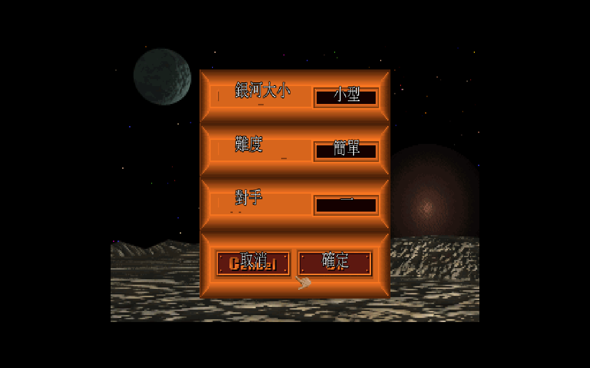

# 01 遊戲概述與歷史地位

《銀河霸主》(Master of Orion, 簡稱 MOO 或 MOO1) 是 1993 年由 Simtex 開發、MicroProse 發行的回合制太空 4X 策略遊戲;玩家率領十大星際種族其中之一,透過探索、擴張、開發與征服,角逐整個銀河系的霸權。它被公認為太空 4X 類型的奠基之作,三十年來持續影響後世無數策略遊戲。

*每一局都從這裡開始:挑銀河大小、難度與對手數量,面板標籤與選項全面繁體中文化。*

## 一句話定位

「在隨機生成的銀河裡,從一顆母星出發,靠科技、外交與艦隊把其他九個種族壓下去,成為 Orion 的霸主。」

## 什麼是 4X

4X 指策略遊戲的四個核心動詞,字首都是 X 的英文諧音:

- **eXplore (探索)** — 派偵察艦點亮星圖,找出可殖民的行星。
- **eXpand (擴張)** — 派殖民船佔領行星,擴大版圖。
- **eXploit (開發)** — 在行星上蓋工廠、實驗室,把人口與資源轉成生產力與科技。
- **eXterminate (殲滅)** — 用艦隊與地面部隊消滅對手。

「4X」這個詞本身,正是遊戲記者 Alan Emrich 在 1993 年《Computer Gaming World》預覽本作時所創,如今已成為整個遊戲類型的通稱。MOO1 因此不只是一款好遊戲,更是一個遊戲類型名稱的起點。

## 設計與開發

| 項目 | 內容 |
|---|---|
| 開發商 | Simtex Software(1988 年由 Steve Barcia 創立) |
| 發行商 | MicroProse |
| 首席設計 | Steve Barcia(德州奧斯汀的電機工程師,業餘時間開發) |
| 核心團隊 | Steve Barcia、Marcia (Maria) Barcia、Kenneth (Ken) Burd |
| 原型名稱 | **Star Lords**,1993 年初提交給 MicroProse |
| 平台/年份 | MS-DOS,1993 年 9 月 |
| 設計顧問 | Alan Emrich、Tom Hughes 協助精修設計 |

原型《Star Lords》在 MicroProse 與遊戲記者 Alan Emrich 的協助下持續打磨,最終成為《Master of Orion》。本作常被形容為「科幻版的《文明》(Civilization)」,但它在種族非對稱設計、即時可視的星圖戰略層、以及科技隨機性等面向走出了自己的路。

## 為什麼是經典

- **十大種族高度非對稱**:每個種族有截然不同的加成與弱點(見 [02 種族](02-races.md)),玩法天差地遠,重玩價值高。
- **科技樹的隨機性**:每場遊戲每個科技領域只會「亮出」一部分可研究項目(一般種族約 50%),逼玩家臨機應變,而非每局照抄同一條最佳路線。
- **戰略與戰術分層**:銀河星圖負責大戰略(殖民、艦隊調度、外交),進入戰鬥後切換到回合制戰術畫面操控艦隊。
- **緊湊耐玩**:相較後續續作,MOO1 規則精煉、節奏明快,被許多老玩家視為系列最佳平衡的一作。

## 勝利條件

MOO1 主要有兩種結束方式:

1. **軍事征服** — 消滅或臣服所有其他種族,獨佔銀河。
2. **銀河議會 (Galactic Council) 推舉** — 當某個帝國的勢力夠大,銀河議會召開投票;若有候選人取得**全銀河總票數三分之二以上**,即當選銀河霸主、遊戲結束。各帝國的票數依其控制的人口規模分配。若你被票選為霸主以外的對手,可以選擇拒絕承認、繼續以武力周旋(但代價是與當選者及其支持者全面開戰)。

> 補充:被推舉當選需要長期經營人口與外交;軍事路線則是直接把對手抹掉。兩條路常交織並用——先靠外交與科技壯大,再決定是投票收尾還是艦隊收尾。

## 版本 1.3

原版 MOO1 歷經數次更新,**1.3 版**是廣為流傳、修正多數平衡與錯誤的穩定版本,也是本中文化專案的基準版本。本專案採用開源引擎 **1oom**(GPLv2)重現原版,直接讀取原版資料檔執行,玩法與數值與原版 1.3 一致,差別僅在跨平台支援與本專案附加的繁體中文化。

## 中英對照表

本篇出現的歷史與玩法名詞中英對照。

| 中文 | English |
|---|---|
| 銀河霸主 | Master of Orion |
| 4X(探索/擴張/開發/殲滅) | 4X (eXplore / eXpand / eXploit / eXterminate) |
| 回合制策略 | Turn-Based Strategy |
| 銀河議會 | Galactic Council |
| 軍事征服 | Military Conquest |
| 母星 | Home Planet |
| 史提夫·巴西亞(設計者) | Steve Barcia |
| 心靈科技(開發商) | Simtex |
| 微軟普羅斯(發行商) | MicroProse |

> 完整玩法術語中英對照,見 [06 術語表](06-glossary.md)。

## 參考來源

- Wikipedia — Master of Orion: <https://en.wikipedia.org/wiki/Master_of_Orion>
- Wikipedia — Simtex: <https://en.wikipedia.org/wiki/Simtex>
- The Digital Antiquarian — Master of Orion: <https://www.filfre.net/2020/01/master-of-orion/>
- The Avocado — Franchise Festival #91: Master of Orion: <https://the-avocado.org/2020/05/22/franchise-festival-91-master-of-orion/>
- StrategyWiki — Master of Orion: <https://strategywiki.org/wiki/Master_of_Orion>
